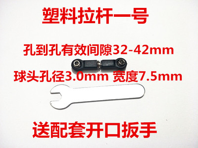

# silly dog物料清单

|       名称       | 尺寸           | 数量 | 其他 |
| :---------------: | -------------- | :--: | ---- |
|    arduino uno    |                |  1  |      |
|      esp01s      |                |  1  |      |
|     舵机sg90     |                |  4  |      |
|     舵机mg996     |                |  4  |      |
|   舵机mg996舵盘   |                |  4  |      |
| 舵机16路pwm拓展版 |                |  1  |      |
|     降压模块     |                |  1  |      |
|      陀螺仪      |                |  1  |      |
|     舵机推杆     |                |  4  |      |
|    大口径轴承    |                |  4  |      |
|      纽扣线      |                |  2  |      |
|     方形电池     |                |  6  |      |
|  0.96oled四针脚  |                |  1  |      |
|  圆头食人鱼灯珠  |                |  2  |      |
|       喇叭       |                |  1  |      |
|    自攻螺丝m3    | 长             | 多个 |      |
|      螺柱m3      | 长，10，20，40 | 多个 |      |
|    自锁螺母m3    |                | 多个 |      |

商家给出的尺寸图只作为参考，具体尺寸得需要根据最后实物来具体测量，然后再修改3D模型尺寸，最后在3D打印。

---

1. 舵机sg90

   
2. 舵机msg996

   
3. 舵机mg996舵盘

   
4. 轴承

   
5. 球头拉杆

   
